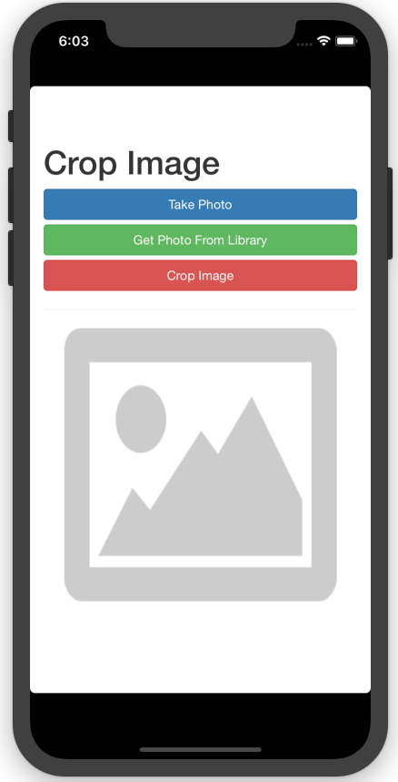

# Crop Image

### Created By Mohammad Tabrez Ansari
This project was generated with [cordova-plugin-crop](https://github.com/jeduan/cordova-plugin-crop).

## Create your cordova project

 Go to terminal and run.
 ```bash
 cordova create your_project_name
 ```
 Now add plugins.
 ```bash
 $ cd your_project_name
 $ cordova plugin add cordova-plugin-crop
 $ cordova plugin add cordova-plugin-camera
 ```
Add your platform.
```bash
$ cordova platform add ios
$ cordova platform add android
```
## Screenshot

<p>
  
</p>

## IOS

Open your_project_name.xcodeproj
In index.html copy the following code.
```bash
<!DOCTYPE html>
<html>
    <head>
        <meta name="format-detection" content="telephone=no">
        <meta name="msapplication-tap-highlight" content="no">
        <meta name="viewport" content="user-scalable=no, initial-scale=1, maximum-scale=1, minimum-scale=1, width=device-width">
        <title>Crop Image</title>
        <link rel="stylesheet" href="https://maxcdn.bootstrapcdn.com/bootstrap/3.3.7/css/bootstrap.min.css">
        <script src="https://ajax.googleapis.com/ajax/libs/jquery/3.3.1/jquery.min.js"></script>
        <script src="https://maxcdn.bootstrapcdn.com/bootstrap/3.3.7/js/bootstrap.min.js"></script>
    </head>
    <body>
        <div class="container my-5">
            <h1>Crop Image</h1>
            
            <div class="row">
                <div class="col-md-4 col-lg-2">
                    <button class="btn btn-primary  btn-block" id="getCamera" onclick="getCamera()" >Take Photo</button>
                    <button class="btn btn-success  btn-block" id="getPicture" onclick="getPicture()" >Get Photo From Library</button>
                    <button class="btn btn-danger  btn-block" id="cropImage" onclick="cropimages()" >Crop Image</button>
                </div><!-- /col -->
            </div><!-- /row -->
            
            <div align="center">
                <hr>
                <image src="img/Placeholder.png" id="myImage" style="width:300px;height:300px;"/>
            </div>
        </div><!-- /container -->
        <script type="text/javascript" src="cordova.js"></script>
        <script type="text/javascript">
            /** Device Ready */
            document.addEventListener('deviceready',function(){ navigator.splashscreen.hide(); },false);
        
            /** Camera */
            function getCamera(){
                navigator.camera.getPicture(onCameraSuccess, onFailed, { quality: 50,
                                            destinationType: Camera.DestinationType.FILE_URI
                                            });
            }
            function onCameraSuccess(imageData){
                console.log(imageData);
                var image = document.getElementById('myImage');
                image.src = imageData;
            }
            function onFailed(message) {
                alert('Failed because: ' + message);
            }
            /* Get Photo from Library */
            function getPicture(){
                navigator.camera.getPicture(onSuccess, onFail, { quality: 50,
                                            sourceType: Camera.PictureSourceType.PHOTOLIBRARY});
            }
            function onSuccess(imageData){
                console.log(imageData);
                var image = document.getElementById('myImage');
                image.src = imageData;
            }
            function onFail(message) {
                alert('Failed because: ' + message);
            }
            /* Crop Image */
            function cropimages(){
                var image = document.getElementById('myImage');
                plugins.crop(function success (data) {
                             console.log(data);
                             var image = document.getElementById('myImage');
                             image.src = data;
                             },
                             function fail () {
                             }, image.src, {quality:100});
            }
        </script>
    </body>
</html>
```
Remove your `index.js` and `index.css` and add `bootstrap.css` in css folder.

## Permission

Go to the your_project_name-info.plist file and add permission for camera `Privacy - Camera Usage Description`.

## Run ios

Run `$ cordova run ios` to execute the program in your iphone or emulator.

## Android

Open android folder in android studio.
In index.html copy the same code as above.
Remove your `index.js` and `index.css` and add `bootstrap.css` in css folder.

## Run android

Run `$ cordova run android` to execute the program in your android phone or emulator.


